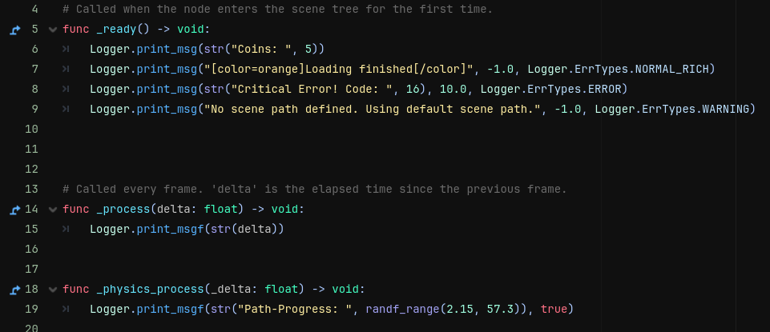
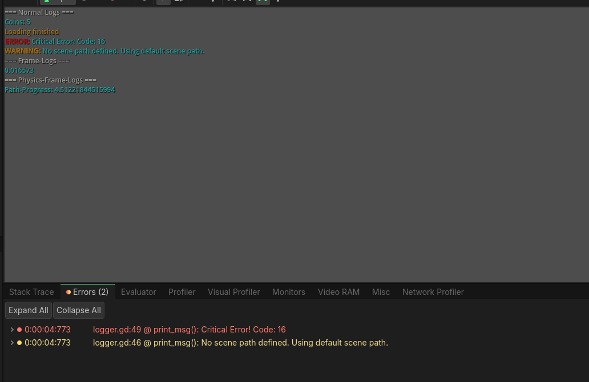

# On-Screen Logger
A logger that displays any message on screen. Useful for printing debugging messages when you don't want to print the message into the log.

## Usage Examples:

    # Printing when something happens.
    func set_coins(value: int) -> void:
	    coins = value
	    Logger.print_msg(str("Coins: ", coins))

    
    # Printing something every process-frame.
    func _process(delta: float) -> void:
	    Logger.print_msgf(str(delta))

    
    # Printing a PathFollow(2D/3D)'s 'progres' value every physics-frame in orange.
    func _physics_process(delta: float) -> void:
	    Logger.print_msgf(str("Path-Progress", progress), true, Color.ORANGE)

 
	# Printing something on-screen and in the output panel
	# with the default duration (-1.0 -> 5 seconds).
	Logger.print_msg("[color=orange]Loading finished[/color]", -1.0, Logger.ErrTypes.NORMAL_RICH)

 
	# Printing an Error 10 seconds long (Also prints it into debugger and output panel).
	Logger.print_msg(str("Critical Error! Code: ", err), 10.0, Logger.ErrTypes.ERROR)

 
	# Printing a Warning (Also prints it into godot's debugger and output panel).
	Logger.print_msg("No scene path defined. Using default scene path.", -1.0, Logger.ErrTypes.WARNING)

**Implementation:**

**Output:**

